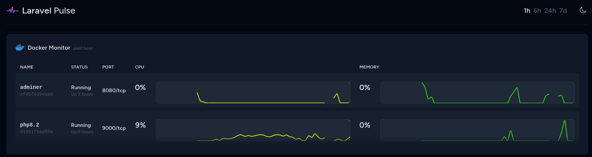

<link rel="stylesheet" href="https://cdnjs.cloudflare.com/ajax/libs/font-awesome/5.15.3/css/all.min.css">
<link rel="stylesheet" type="text/css" href="https://cdn.example.com/font/font.css">


<h1 align="center" style="font-family: 'CustomFont';"><u>Docker Monitor Card For Laravel Pulse</u></h1>

## <p style="font-family: 'CustomFont';">_About_</p>


<p style="font-family: 'CustomFont'; font-size: 18px">This card will monitor your docker containers and show container statistics with Cpu & Memory Load.</p>

<br>
<p align="center"></p>

## <p style="font-family: 'CustomFont';"><i class="fas fa-cog"></i> _Installation_</p>
<br>
<p style="font-family: 'CustomFont';"> Please check the official laravel installation guide for server requirements before you start. <a href="https://laravel.com/docs/10.x/pulse">[Official Documentation]</a></p>

<p style="font-family: 'CustomFont';"><b>Require the package with Composer:</b></p>

```shell
    composer require vcian/pulse-docker-monitor
```
    
<p style="font-family: 'CustomFont';"><b>Next, you should publish the Pulse configuration and migration files using the vendor:publish Artisan command:</b></p>

```shell
    php artisan vendor:publish --provider="Laravel\Pulse\PulseServiceProvider"
```

<p style="font-family: 'CustomFont';"><b>Next, you should run the migration for required tables</b></p>

```shell
    php artisan migrate
```

## <p style="font-family: 'CustomFont';">Register the recorder</p>

<p style="font-family: 'CustomFont';">Right now, the Composer dependencies will only be checked once per day. To run the checks you must add the PulseDockerMonitorRecorder to the pulse.php file.</p>


```diff
return [
    // ...
    
    'recorders' => [
+        \Vcian\Pulse\PulseDockerMonitor\Recorders\PulseDockerMonitorRecorder::class => [],
    ]
]
```

<p style="font-family: 'CustomFont';"> You also need to be running the <a href="https://laravel.com/docs/10.x/pulse#dashboard-cards">pulse:check</a> command.</p>

## <p style="font-family: 'CustomFont';">Add to your dashboard</p>

<p style="font-family: 'CustomFont';">To add the card to the Pulse dashboard, you must first <a href="https://laravel.com/docs/10.x/pulse#dashboard-customization"> [publish the vendor view] </a></p>

<p style="font-family: 'CustomFont';">Then, you can modify the dashboard.blade.php file: </p>

```diff
<x-pulse>
+     <livewire:pulse_docker_monitor cols="full" />

    <livewire:pulse.servers cols="full" />

    <livewire:pulse.usage cols="4" rows="2" />

    <livewire:pulse.queues cols="4" />

    <livewire:pulse.cache cols="4" />

    <livewire:pulse.slow-queries cols="8" />

    <livewire:pulse.exceptions cols="6" />

    <livewire:pulse.slow-requests cols="6" />

    <livewire:pulse.slow-jobs cols="6" />

    <livewire:pulse.slow-outgoing-requests cols="6" />

</x-pulse>
```

<p style="font-family: 'CustomFont';">To make pulse recorders will automatically capture entries based on framework events dispatched by Laravel, You must run the below command.</p>

```shell
    php artisan pulse:check
```
## <p style="font-family: 'CustomFont';"> Security

<p style="font-family: 'CustomFont';">If you discover any security-related issues, please email ruchit.patel@viitor.cloud instead of using the issue tracker. </p>

## <p style="font-family: 'CustomFont';">Credits

- [All Contributors](../../contributors)

## <p style="font-family: 'CustomFont';">License
The MIT License (MIT). Please see [License File](LICENSE.md) for more information.


